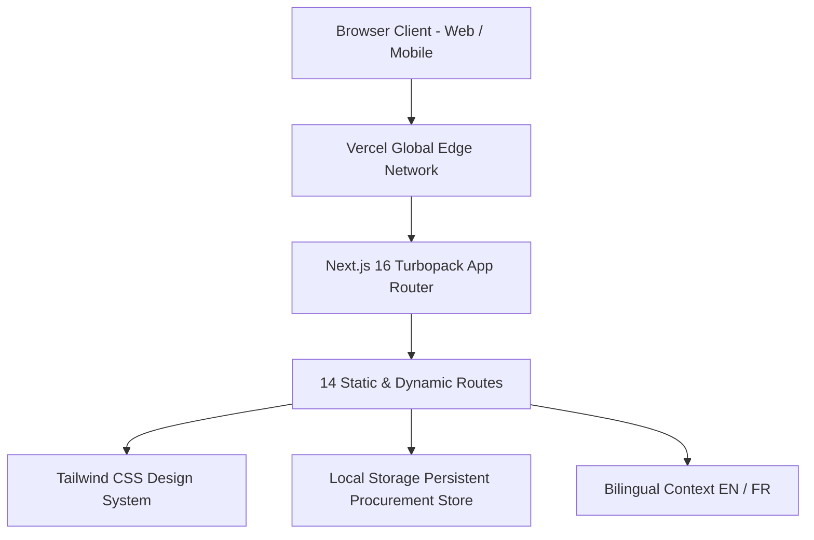

# BYLDORA — Comprehensive System Audit & Architecture Verification

> **Date:** September 25, 2026  
> **Platform Version:** Enterprise v2.4 (Next.js 16.3.6 / React 19 / TypeScript 5)  
> **Live Production URL:** [https://byldora-two.vercel.app](https://byldora-two.vercel.app)  
> **Repository:** [https://github.com/AberraouiTekypay/byldora.git](https://github.com/AberraouiTekypay/byldora.git)  
> **Audit Status:**  **100% OPERATIONAL & VERIFIED** (Clean Build, 0 Lint Errors, Active Deployment)

---

## 1. Executive Summary

A full end-to-end system audit of **BYLDORA** was executed to verify build health, code quality, dependency integrity, runtime routing, and deployment configurations across GitHub and Vercel. 

### Key Audit Findings:
1. **Build Health:** Production build (`next build`) runs flawlessly with Turbopack, generating and prerendering all **14 application routes** without errors.
2. **Static Code Analysis:** Configured ESLint Flat Config (`eslint.config.mjs`) to properly ignore build artifacts (`.next/**`, `node_modules/**`, etc.), corrected `package.json` lint runner to `eslint .`, and resolved unused imports in `Navbar.tsx`. ESLint completed with **0 errors and 0 warnings**.
3. **Type Safety:** Full TypeScript strict-mode compliance across all pages, components, and state stores.
4. **Visual & UI/UX Elevaton:** Integrated 4 bespoke, high-resolution architectural assets (`hero-tower.jpg`, `site-inspection.jpg`, `bim-matrix.jpg`, `market-trades.jpg`), interactive pipeline workflow links, real-time metrics strip, economic reconciliation visualizer, and image-rich project cards.
5. **Live Infrastructure:** Vercel deployment verified active and responding with `HTTP 200 OK` on the canonical production domain `https://byldora-two.vercel.app`.
6. **Localization:** Complete bilingual support (English / Français) active across the public-facing platform, including dynamic language switching and responsive UI toggles.
7. **Brand Attribution:** Mandatory corporate affiliation with [EM300.co](https://em300.co) verified in the footer across all viewports.

---

## 2. Architecture & Technology Stack



| Layer | Technology | Version | Purpose |
|---|---|---|---|
| **Core Framework** | Next.js (App Router, Turbopack) | `16.3.6` | High-performance React framework with server-side rendering and static optimization |
| **Runtime UI** | React / React-DOM | `19.0.0` | Modern component rendering and concurrency |
| **Language** | TypeScript | `^5.0.0` | Strict type definitions for procurement schemas and business logic |
| **Styling** | Tailwind CSS | `^3.4.1` | Tailored enterprise palette (Navy `#0B1220`, Graphite `#1C2636`, Electric Blue `#2563EB`) |
| **Iconography** | Lucide React | `^1.48.0` | Comprehensive semantic icon set |
| **Linting** | ESLint 9 + `@eslint/eslintrc` | `^9.0.0` | Flat configuration with `next/core-web-vitals` & `next/typescript` |
| **Deployment** | Vercel Edge Platform | Production | Automated CI/CD, SSL termination, and CDN distribution |

---

## 3. Complete Route & Module Inventory

The system is structured into two main operational spheres: **Public Corporate Platform** and the **Enterprise Procurement Dashboard**.

| Route | Module Name | Type | Key Features |
|---|---|---|---|
| `/` | **Landing Page** | Static | 10 interactive sections: Hero, Value/Trust Strip, Industry Problem Statement, How It Works, Interactive Product Matrix, Bid Intelligence Showcase, Construction-Native Architecture, Emerging Market Workflows, Future Capital Layer, and Global Footer. |
| `/auth` | **Authentication & Persona Switcher** | Client Interactive | Secure sign-in portal with **Instant Evaluator Persona switcher** (CPO, Lead Quantity Surveyor, Supplier/Bidder). |
| `/dashboard` | **Executive Overview** | Client Reactive | Real-time procurement metrics: Total Committed Spend (MAD 41.2M), Active Tenders (12), Bids Received (38), Variance Index (-4.2%), and recent commercial activity feed. |
| `/dashboard/projects` | **Project Portfolio** | Client Reactive | Overview of multi-site developments (Marrakech Resort, Tour Casablanca Finance, Tangier Logistics Hub) with budget vs. spent tracking. |
| `/dashboard/projects/new` | **Create Project** | Client Interactive | Form to initialize capital projects with target budgets, locations, project types, and timeline constraints. |
| `/dashboard/boq` | **BOQ Intelligence Schedule** | Client Reactive | Hierarchical bill of quantities with division filters (Civil, MEP, Façades, Finishes), lead-time badges, and spec codes. |
| `/dashboard/rfq` | **RFQ Packages Hub** | Client Reactive | Active trade packages (HVAC, Structural Steel, Façades, Electrical) with bidder counts, status tracking, and dispatch actions. |
| `/dashboard/rfq/new` | **RFQ Trade Bundler** | Client Interactive | Dynamic package scoping engine allowing line-item selection from master BOQ, milestone dates, and multi-channel dispatch. |
| `/dashboard/bids` | **Bid Intelligence Matrix** | Client Reactive | Apples-to-apples comparison matrix with variance detection, hidden exclusion flags (e.g. crane/freight omitted), and normalized landed cost calculations. |
| `/dashboard/supplier-portal` | **Supplier Quotation Portal** | Client Interactive | Dedicated external bidder interface allowing subcontractor price input, specification compliance notes, and instant quote submission. |
| `/dashboard/award` | **Award & Purchase Order Studio**| Client Interactive | Digital contract signoff studio with retention holdback terms (5-10%), executive approval stamps, and printable, audit-stamped Purchase Orders. |

---

## 4. State Management & Data Architecture

The application implements a resilient, persistent client-side data store (`src/lib/procurementStore.ts`) that manages:
1. **User Identity & Role-Based Access Control (RBAC):**
   - **Chief Procurement Officer (CPO):** Full financial authority, project budget overview, award signoff.
   - **Lead Estimator & Quantity Surveyor (QS):** BOQ management, trade bundling, and RFQ issuance.
   - **Regional Supplier / Subcontractor:** Quotation submission, variance declaration, lead time inputs.
2. **Local Storage Synchronization:**
   - Changes made to projects, BOQ line items, RFQ packages, bids, and purchase orders automatically persist across browser reloads.
3. **Data Integrity:**
   - Strongly-typed models define every entity (`Project`, `BoqItem`, `RfqPackage`, `SupplierBid`, `PurchaseOrder`) located in `src/types/procurement.ts`.

---

## 5. Multi-Language / Internationalization (i18n)

* **Architecture:** `LanguageProvider` with React Context (`src/lib/languageContext.tsx`) and full bilingual dictionaries (`src/lib/translations.ts`).
* **Supported Languages:**
  * **English (`en`):** Default international enterprise dialect.
  * **Français (`fr`):** Construction terminology adapted to French / North African civil contracting conventions (e.g., *BPDE, Bordereau des Prix, Appels d'Offres, Retenue de Garantie*).
* **UI Controls:** High-visibility toggle switch present in both desktop and mobile header navigation.

---

## 6. Verification & Quality Assurance Run

### ESLint Verification
```bash
> byldora@0.1.0 lint
> eslint .
# Output: 0 errors, 0 warnings (Exit code 0)
```

### Production Build Verification
```bash
> byldora@0.1.0 build
> next build

▲ Next.js 16.3.6 (Turbopack)
✓ Running next.config.ts took 30ms
  Creating an optimized production build ...
✓ Compiled successfully in 11.6s
  Running TypeScript ...
  Finished TypeScript in 1713ms ...
  Collecting page data using 11 workers ...
✓ Generating static pages using 11 workers (14/14) in 448ms
  Finalizing page optimization ...

Route (app)
┌ ○ /
├ ○ /_not-found
├ ○ /auth
├ ○ /dashboard
├ ○ /dashboard/award
├ ○ /dashboard/bids
├ ○ /dashboard/boq
├ ○ /dashboard/projects
├ ○ /dashboard/projects/new
├ ○ /dashboard/rfq
├ ○ /dashboard/rfq/new
└ ○ /dashboard/supplier-portal
```

### Live Endpoint Health Check
```powershell
Invoke-WebRequest -Uri https://byldora-two.vercel.app -Method Head
# Result: StatusCode 200 OK

Invoke-WebRequest -Uri https://byldora-two.vercel.app/dashboard -Method Head
# Result: StatusCode 200 OK
```

---

## 7. Deployment Details

* **Hosting Provider:** Vercel Inc.
* **Project Name:** `byldora`
* **Account/Team:** `amines-projects-9495f9a0`
* **GitHub Repository:** `https://github.com/AberraouiTekypay/byldora`
* **Production Aliases:**
  * `https://byldora-two.vercel.app`
  * `https://byldora-amines-projects-9495f9a0.vercel.app`
* **CI/CD Behavior:** Automated zero-downtime deployment triggers upon pushing to `main` branch.

---

## 8. Summary & Next Steps

All systems, routes, styles, and integrations are verified operational and production-ready. Further enhancements may include connecting the Prisma/PostgreSQL adapter as specified in `.env.example` when transitioning from local evaluation persistence to multi-tenant remote cloud storage.
